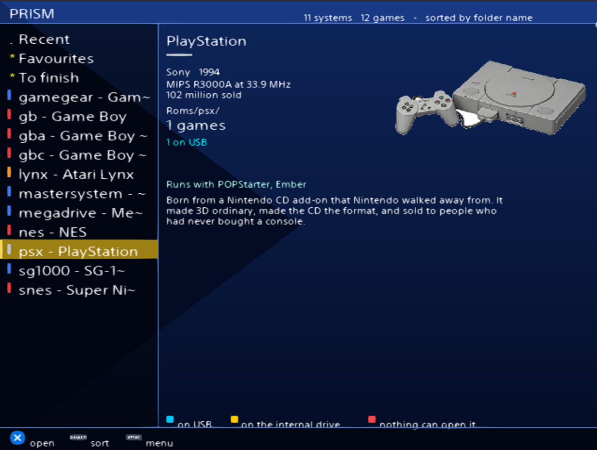
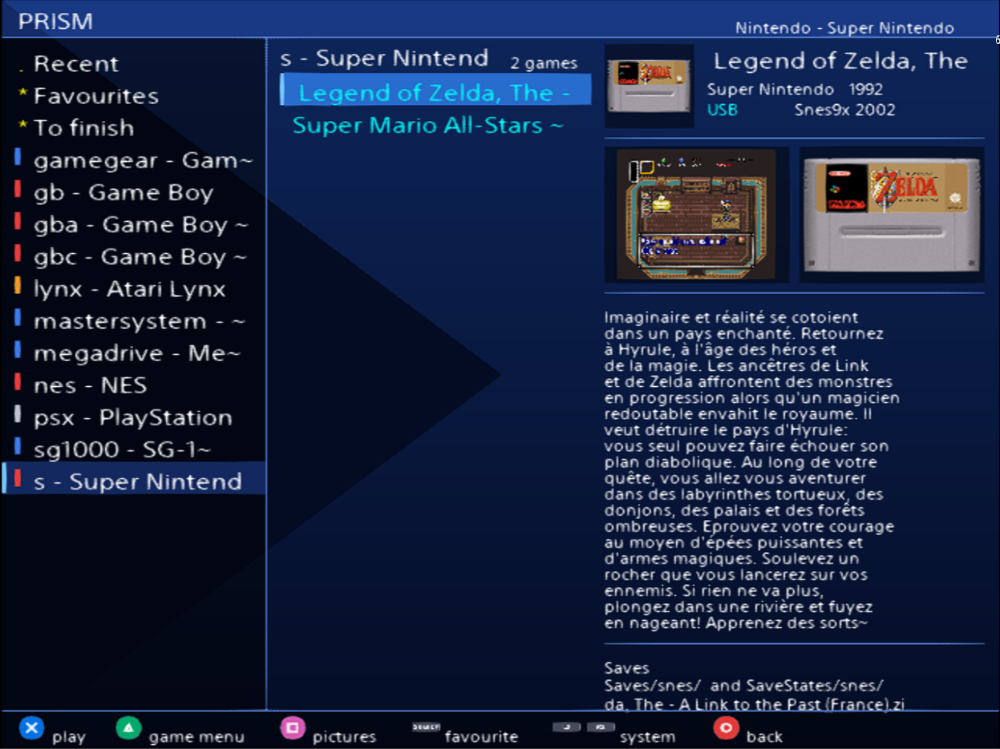
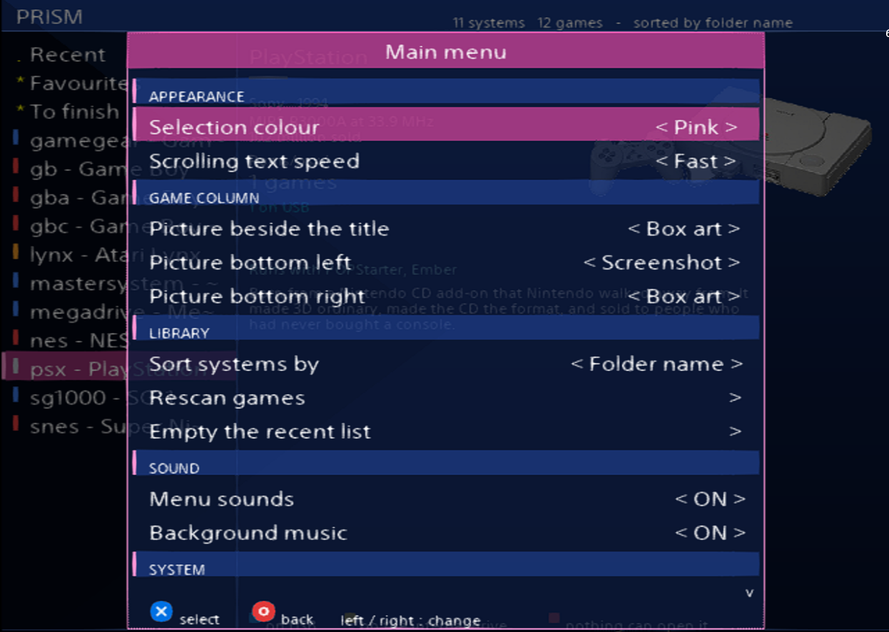
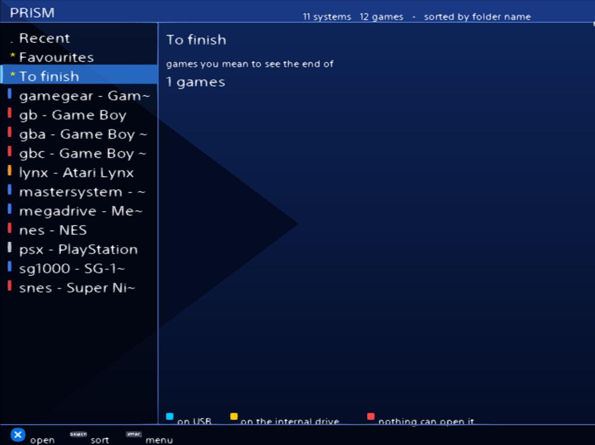
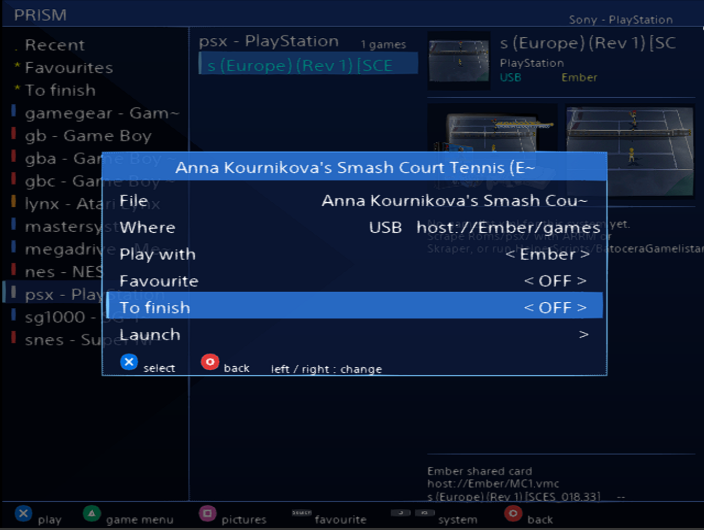
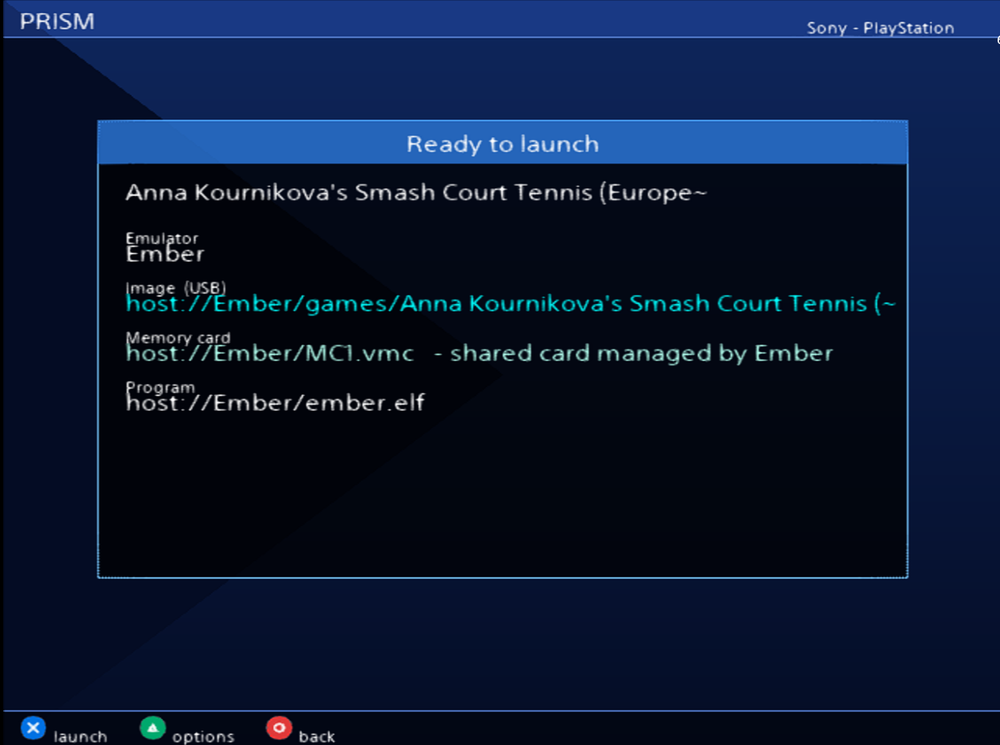
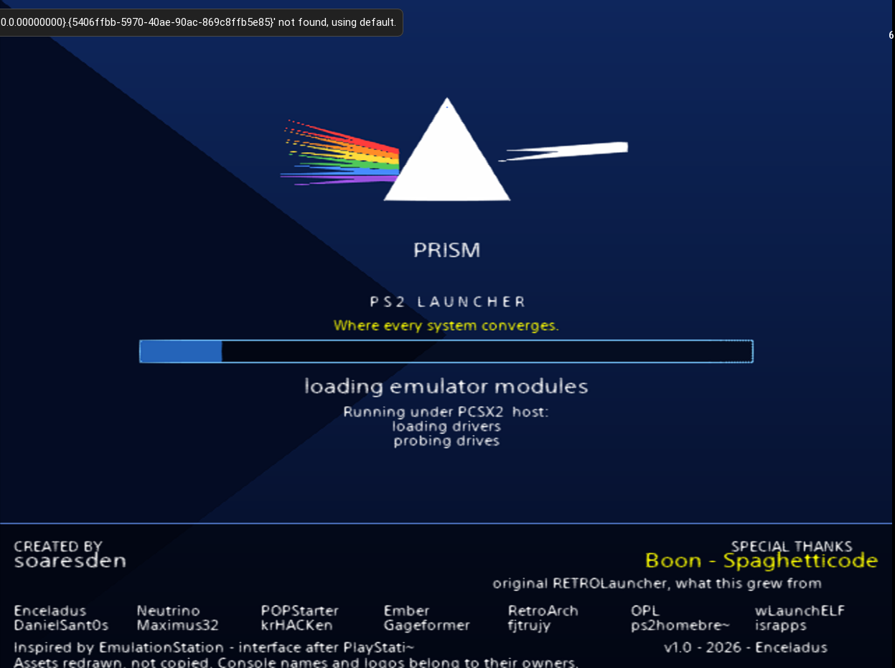

<p align="center">
  
</p>

# Prism PS2 Launcher

A game launcher for the PlayStation 2, written in Lua on [Enceladus](https://github.com/DanielSant0s/Enceladus), that runs from an **internal exFAT drive**, a USB stick or an MMCE — and drives every emulator the console has: the 61 RetroArch cores, POPStarter and Ember for PlayStation 1, Neutrino and OPL for PlayStation 2.

One library, one interface, one place to put your games. The emulator is decided by the file, not by you.

Every picture below is a screenshot of the launcher running.

---

## The interface

<p align="center">
  
  
</p>

The systems live in a column on the left — up/down to move, L1/R1 from inside a game list. A coloured bar carries the manufacturer, because a console logo squeezed into twenty pixels is a smudge you cannot name. The panel on the right is about the **machine**, not its games: a photograph of it, its maker and year, its CPU, how many were sold, the folders Prism reads for it, which emulators can run it, and how many of your games are on which drive.

Opening a system gives three columns: systems, games, and the game you are on — its title beside a picture, a pair of pictures under it, the description a scraper found, and **where its saves are**. Which picture goes in each of the three slots is yours to set.

**Cyan** means a USB stick, **yellow** the internal exFAT drive, **red** a file nothing on the console can open. The legend is on screen: a colour that needs a manual is a colour that failed.

<p align="center">
  
  
</p>

START opens the menu as an overlay, in sections: appearance, game column, library, sound, system, about. The selection bar comes in nine colours. Long lines scroll rather than ending in a tilde, at a speed you choose.

At the top of the systems column sit three lists that are not consoles. **Recent**, the last thirty games you played. **Favourites**, on SELECT from any list. **To finish** — the one EmulationStation does not have, and the reason the file exists: a shelf for the games you mean to see the end of. Games pile up faster than anyone finishes them, and a library sorted by console is no help in answering *what was I in the middle of*.

Systems sort by folder name, by manufacturer or by year of release.

<p align="center">
  
  
</p>

Triangle opens the game menu: which emulator runs this one, favourite, to finish, and the memory card for PlayStation games. Square puts the pictures full screen — screenshot first, then the box, then the cartridge, L1/R1 to walk round them.

Nothing starts until you say so. The *Ready to launch* screen states exactly what is about to happen: which emulator, which disc image, which program — and **which memory card, with its full path**, because a PlayStation 1 save lives on a card and which card that is decides whether the save is still there tomorrow. Anything the emulator is still missing is said **here**, before you press X, rather than after the screen has gone black and come back.

<p align="center">
  
</p>

The look follows EmulationStation as Batocera ships it, and borrows its language from the [PlayStation-X](https://github.com/pajarorrojo/es-theme-PlayStation-X) theme by pajarorrojo — the panels, the selector, the coloured buttons — redrawn for a 4:3 CRT rather than copied.

---

## What works today

**Booting from an internal exFAT drive**, which no PS2 launcher did. Every PS2 libretro core calls `SifIopReset()` on start, which wipes the IOP and reloads only the USB drivers — never `ata_bd`. The internal drive ceases to exist for the core. Prism works around it with a two-installation model: a *master* install next to the launcher holding every core, and a *shuttle* on the USB stick holding one core and one ROM, copied there at launch, with progress in KB on screen.

**PlayStation 2** — `DVD/` and `CD/` at the drive root, as OPL and Neutrino read them, and `Roms/ps2/` for anything dropped in the obvious place instead. A launch menu before every game: real memory card or VMC, which VMC file (cards for this game first, *See all VMC files* for the rest, create one named after the game), Neutrino or OPL.

**PlayStation 1, two emulators, one list.** POPStarter takes `.VCD` from `POPS/`; Ember Beta 1 takes `.cue`/`.bin` from `Ember/games/<Game>/`. A game present in both forms is listed once, and which one will run it is written in **pink for POPStarter, orange for Ember**.

A disc image left loose in `Roms/psx/` is found too — and played. Ember is handed the *name* of a folder, never a path, so the disc has to be in `Ember/games/`: Prism moves it there at launch and puts it back when you launch something else. On one drive that is a rename, which costs nothing whatever the size of the file. One parking space, and what is in it is by definition the last played. The `.vmc` cards Ember writes stay behind in the game's folder, so your saves are still there the next time.

Multi-disc games get their `DISCS.TXT`, and the disc-swap combinations are shown for five seconds before the game starts, because POPStarter shows them nowhere.

**The BIOS under the name it came with.** Nobody's dump is called `bios.bin`. Drop `scph1001.bin`, `SCPH5502.BIN` or any of fifteen other names into `Bios/` and the copy Ember wants is made for you, once.

**RetroArch, 61 cores, 66 systems.** The systems table is *generated* from the cores' own `.info` files by `HelperScripts/BuildSystems.py` — a core added to the drive appears after one run. Fourteen systems offer a choice of core; five for Game Boy alone.

**`gamelist.xml`, the EmulationStation format**, read and written. ARRM, Skraper and Batocera's own scraper work on a Prism stick with no conversion. A system with no gamelist gets a starting one; a game on the drive that no gamelist mentions is appended with its name rather than left undescribed.

**Diagnostics you can read.** One log per session, `log/Debug_YYYY-MM-DD_HHMMSS.log`, every step written *before* it happens so a freeze names the culprit. A boot checklist on the loading screen. Every launch dumps what it is about to do — core, ROM, config, memory card — just before `loadELF`.

Sound, artwork, titles, save relocation between drives: all covered in [CHANGES.md](CHANGES.md), each with the code that was wrong and why.

---

## Installing

From a USB stick there is nothing to know: copy `Prism/` onto it and launch `Prism.elf` from uLaunchELF, OPL or whatever you already use.

**From the internal drive there is exactly one thing to know, and it is not optional.** The menu entry has to pass Prism an argument:

```
mc0:/PRISMBOOT/boot.lua
```

In `mc0:/SYS-CONF/OSDMENU.CNF`, with the same item number on all three lines:

```
name_OSDSYS_ITEM_1  = Prism
path1_OSDSYS_ITEM_1 = mass0:/Prism/Prism.elf
arg_OSDSYS_ITEM_1   = mc0:/PRISMBOOT/boot.lua
```

R3Configurator writes the same thing through a form. Copy `To Transfer on MC/PRISMBOOT/` to `mc0:/PRISMBOOT/` first.

Why it is needed: Enceladus reloads its own USB stack at start, without `ata_bd`, and the drive it was launched from ceases to exist. Given an argument it runs *that* script instead of its built-in boot — and the memory card is always readable. The 3 KB script loads the disc drivers from the card and hands over. Without the argument you get the red *"end of builtin script reached"* screen and nothing else.

Watch for a fallback `path2_`/`path3_` pointing at a stick: it can win the race, and it will not be given the argument.

---

## On the drive

```
<drive>:/
├── Prism/                    the launcher
│   ├── Roms/<system>/        one folder per system, Batocera names
│   │   ├── gamelist.xml      EmulationStation format: names, descriptions, artwork paths
│   │   │                     (written by Prism if missing, completed if incomplete)
│   │   ├── media/covers/     <rom>.png, as EmulationStation lays it out
│   │   ├── media/screenshots/
│   │   ├── media/cartridges/
│   │   └── titles.txt        fallback names when there is no gamelist.xml
│   ├── Roms/psx/             artwork for EVERY PS1 game, POPS or Ember alike
│   │                         — and loose .cue/.bin, which are played from here
│   ├── Ember/                ember.elf, bios.bin, games/<Game>/
│   ├── LibretroPS2Files/     the RetroArch master: cores/, info/, retroarch/
│   ├── Bios/                 system files, copied where each emulator wants them
│   ├── Saves/  SaveStates/   per system, mirroring Roms/
│   └── log/
├── DVD/  CD/                 PlayStation 2 images, for Neutrino and OPL
├── POPS/                     PlayStation 1 .VCD, XX.*.ELF, memory cards
└── VMC/                      PlayStation 2 virtual memory cards
```

Every folder carries a `.INFO - <name>.txt` explaining what goes in it and why.

---

## Helper scripts

Windows-side tools in `HelperScripts/`. None is required to play; all of them save hours. Each one asks for its folders with the answer already in brackets — Enter takes it — and then does the work. `--dry` is the rehearsal.

| Script | What it does |
|---|---|
| `BuildSystems.py` | Generates `System/systems.lua` from the installed cores' `.info` files, and creates the `Roms/<system>/media/` layout in advance |
| `PS1toPOPS.py` | Batocera `.chd` → `.VCD` via `cue2pops`, memory cards merged from Batocera saves (newest wins on conflict), `DISCS.TXT`, launchers, artwork |
| `PS2CHDtoOPLPS2.py` | Batocera `.chd` → OPL-named `.iso` on `CD/` and `DVD/`, delta by size, OPL name rules |
| `BatoceraGamelistandMediaCopier.py` | Screenshots, box art, cartridges and every scrap of scraped text from a Batocera / Recalbox / EmulationStation library, fitted to 320×240 RGBA. It *completes*: it reads the gamelist already on the stick and starts from it, so nothing you scraped or corrected is lost. Pictures no game claims are moved to `media/_unused/`, not deleted |
| `WAVtoADP.py` | WAV ⇄ `.adp` for the menu sounds, with the format documented from ps2sdk |
| `PopsCheck.py` | Verifies a POPStarter install: MD5s, launcher copies, `.VCD` structure |
| `VMCManager.py` | Virtual memory card housekeeping |

Each script's docstring is its documentation: what it does, what it will not do, and every empirical finding it rests on.

---

## Code layout

Two halves, thirty-five files, none of them long.

**The machine** — `index.lua` (pre-boot), `system.lua` (the boot sequence, read top to bottom), `core/` (devices, drives, log, paths, prefs), `emu/` (one file per emulator: retroarch, retroarch_shuttle, retroarch_prepare, pops, ember, ember_park, ps2), `systems.lua` (generated) — is what makes the console do things, and it is proven on hardware.

**The interface** — `ui/theme.lua` (every position and colour, the role of an ES `theme.xml`), `ui/gfx.lua`, `ui/input.lua`, `ui/widgets.lua` (list and modal menu), `library/` (library, gamelist_xml, collections), `views/` (systems, gamelist, viewer, launch, menu), `launch/backends.lua` (one function per emulator), `frontend.lua` (the loop) — is modelled on EmulationStation and depends only on the theme and the library.

There is no theme editor. The interface is styled from one file, and that is enough.

---

## Origins

Prism began as a fork of [RETROLauncher](https://github.com/Spaghetticode-Boon-Tobias/RETROLauncher) by **Spaghetticode (Boon Tobias)**, at commit `e6f9508`. His commits are in this repository's history under his name, and the exFAT support, the launch flows, the PS1 pipeline and the tooling were built on top of his work. The interface has since been rewritten on the Enceladus API — his own suggestion, and the right one.

See [CREDITS.md](CREDITS.md) for everyone whose work this stands on.

## Licence

GPL-3.0 — see [LICENSE](LICENSE). Prism ships no BIOS, no game and no emulator binary that is not free to redistribute; you bring your own, from hardware and discs you own. The console photographs are public domain, with their provenance recorded in `System/Medias/Consoles/SOURCES.txt`.
