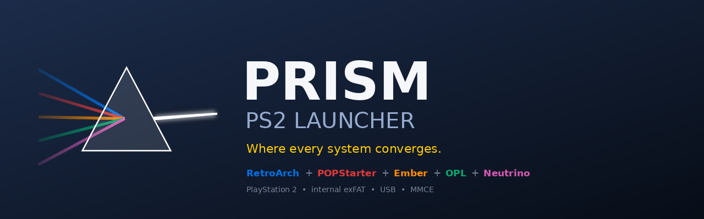
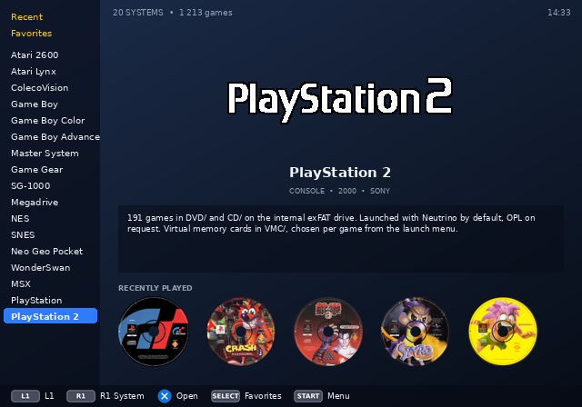
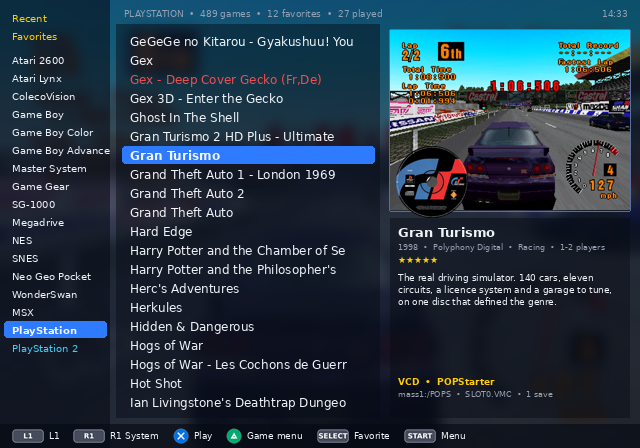
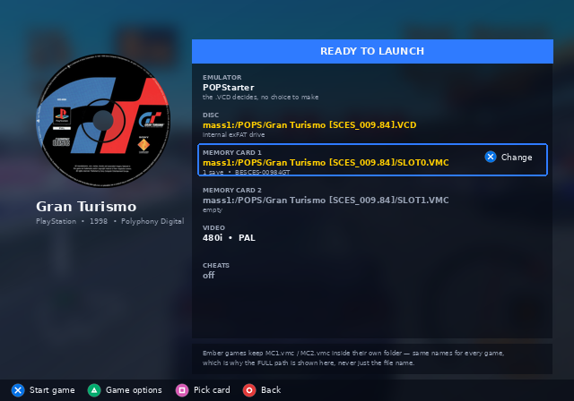
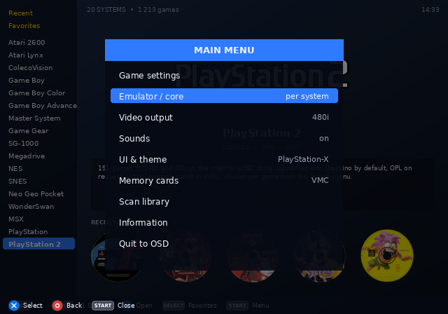
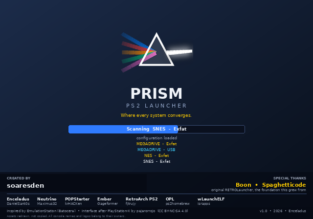

<p align="center">
  
</p>

# Prism PS2 Launcher

A game launcher for the PlayStation 2, written in Lua on [Enceladus](https://github.com/DanielSant0s/Enceladus), that runs from an **internal exFAT drive**, a USB stick or an MMCE — and drives every emulator the console has: the 61 RetroArch cores, POPStarter and Ember for PlayStation 1, Neutrino and OPL for PlayStation 2.

One library, one interface, one place to put your games. The emulator is decided by the file, not by you.

> **Where things stand.** The code in this repository is the working launcher: everything under *What works today* runs on real hardware. The interface shown below is the **design it is being rebuilt towards** — mockups rendered at the console's own 640×448, using real artwork, not screenshots of running code yet. See *Roadmap*.

---

## The interface

<p align="center">
  
  
</p>
<p align="center">
  
  
</p>

The systems live in a column on the left — up/down or L1/R1 to move, including from inside a game list. Validating opens the detailed list: titles, screenshot, cover, developer, players, description, all from the same `gamelist.xml` Batocera writes. START opens the main menu as an overlay. **Yellow** means the internal exFAT drive, **cyan** the USB stick, **red** a file nothing can open.

Before a game starts, a *Ready to launch* screen states exactly what is about to happen: which emulator, which disc image, and — the part that matters — **which memory card, with its full path**, because a PlayStation 1 save lives on a card and which card that is decides whether the save is still there tomorrow.

The look follows EmulationStation as Batocera ships it, and borrows its language from the [PlayStation-X](https://github.com/pajarorrojo/es-theme-PlayStation-X) theme by pajarorrojo — the panels, the blue selector, the coloured buttons — redrawn for a 4:3 CRT rather than copied.

<p align="center">
  
</p>

---

## What works today

**Booting from an internal exFAT drive**, which no PS2 launcher did. Every PS2 libretro core calls `SifIopReset()` on start, which wipes the IOP and reloads only the USB drivers — never `ata_bd`. The internal drive ceases to exist for the core. Prism works around it with a two-installation model: a *master* install next to the launcher holding every core, and a *shuttle* on the USB stick holding one core and one ROM, copied there at launch, with progress in KB on screen.

**PlayStation 2** — `DVD/` and `CD/` at the drive root, as OPL and Neutrino read them. A launch menu before every game: real memory card or VMC, which VMC file (cards for this game first, *See all VMC files* for the rest, create one named after the game), Neutrino or OPL. Nothing launches until you say so.

**PlayStation 1, two ways.** POPStarter takes `.VCD` from `POPS/`; Ember Beta 1 takes `.cue`/`.bin` from `Ember/games/<Game>/`. Both appear in one list. A game present in both forms is listed once. Multi-disc games get their `DISCS.TXT`, and the disc-swap combinations are shown for five seconds before the game starts, because POPStarter shows them nowhere.

**RetroArch, 61 cores, 66 systems.** The systems table is *generated* from the cores' own `.info` files by `HelperScripts/BuildSystems.py` — a core added to the drive appears after one run. Fourteen systems offer a choice of core; five for Game Boy alone.

**Diagnostics you can read.** One log per session, `log/Debug_YYYY-MM-DD_HHMMSS.log`, every step written *before* it happens so a freeze names the culprit. A boot checklist on the loading screen. Every launch dumps what it is about to do — core, ROM, config, memory card — just before `loadELF`.

Sound, theme editor, artwork, titles, save relocation between drives: all covered in [CHANGES.md](CHANGES.md), each with the code that was wrong and why.

---

## On the drive

```
<drive>:/
├── Prism/                    the launcher
│   ├── Roms/<system>/        one folder per system, Batocera names
│   │   └── media/covers, media/screenshots, titles.txt
│   ├── Roms/psx/             artwork for EVERY PS1 game, whatever its format
│   ├── Ember/                ember.elf, bios.bin, games/<Game>/
│   ├── LibretroPS2Files/     the RetroArch master: cores/, info/, retroarch/
│   ├── Bios/                 system files, copied where each emulator wants them
│   ├── Saves/  SaveStates/   per system, mirroring Roms/
│   └── log/
├── DVD/  CD/                 PlayStation 2 images, for Neutrino and OPL
├── POPS/                     PlayStation 1 .VCD, XX.*.ELF, memory cards
└── VMC/                      PlayStation 2 virtual memory cards
```

Every folder carries a `.INFO - <name>.txt` explaining what goes in it and why.

---

## Helper scripts

Windows-side tools in `HelperScripts/`. None is required to play; all of them save hours.

| Script | What it does |
|---|---|
| `BuildSystems.py` | Generates `System/systems.lua` from the installed cores' `.info` files |
| `PS1toPOPS.py` | Batocera `.chd` → `.VCD` via `cue2pops`, memory cards merged from Batocera saves (newest wins on conflict), `DISCS.TXT`, launchers, artwork |
| `PS2CHDtoOPLPS2.py` | Batocera `.chd` → OPL-named `.iso` on `CD/` and `DVD/`, delta by size, OPL name rules |
| `MediaCopier.py` | Artwork and titles from a Batocera / Recalbox / EmulationStation `gamelist.xml`, fitted to 320×240 RGBA |
| `WAVtoADP.py` | WAV ⇄ `.adp` for the menu sounds, with the format documented from ps2sdk |
| `PopsCheck.py` | Verifies a POPStarter install: MD5s, launcher copies, `.VCD` structure |
| `VMCManager.py` | Virtual memory card housekeeping |

Each script's docstring is its documentation: what it does, what it will not do, and every empirical finding it rests on.

---

## Roadmap

The launcher works. The interface is being rebuilt, in this order, each step usable on its own:

1. **Systems table** — done: `System/systems.lua`, generated, English, with `backends_for()` and `scan_roots()`.
2. **One menu widget** — a menu is a list of `{label, get, set, kind}`; one input loop, one renderer, replacing the 29 hand-written loops in the current code.
3. **Two views** — *systems* and *gamelist detailed*, as EmulationStation names them; a theme is a Lua table positioning named elements.
4. **Game settings** — emulator / core per system and per game, written to `systems.cfg` and `games.cfg`.
5. The rest: proportional font, sounds, polish.

---

## Origins

Prism began as a fork of [RETROLauncher](https://github.com/Spaghetticode-Boon-Tobias/RETROLauncher) by **Spaghetticode (Boon Tobias)**, at commit `e6f9508`. His code is still the foundation of the list and menu system, and his commits are in this repository's history under his name. The exFAT support, the launch flows, the PS1 pipeline and the tooling were built on top of it; the interface above is what replaces it.

See [CREDITS.md](CREDITS.md) for everyone whose work this stands on.

## Licence

GPL-3.0 — see [LICENSE](LICENSE). Prism ships no BIOS, no game and no emulator binary that is not free to redistribute; you bring your own, from hardware and discs you own.
